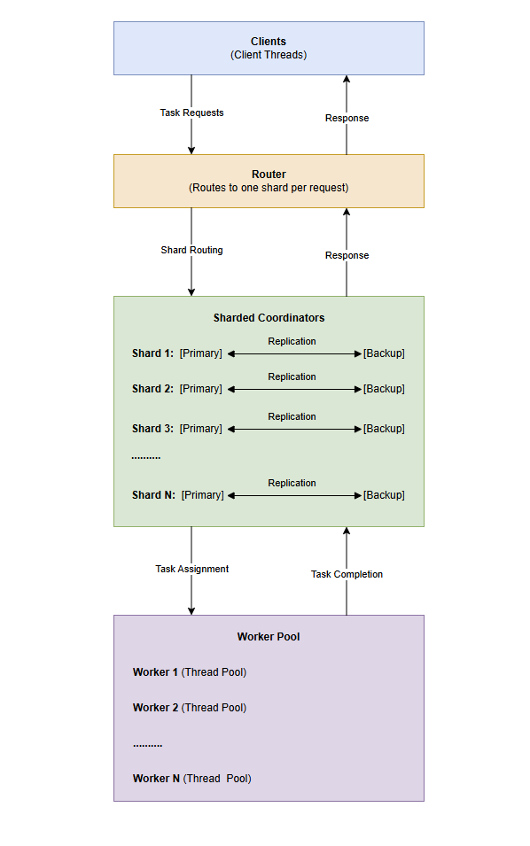
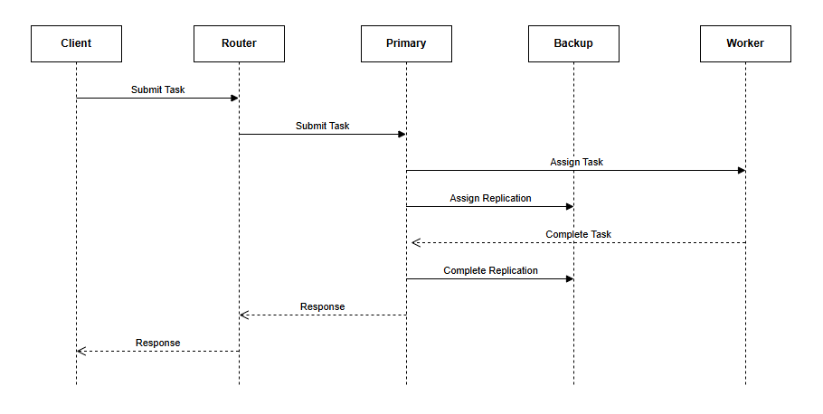

# Distributed Task Coordinator (C++)

A high-performance distributed task scheduling system built in C++, simulating real-world job coordination across multiple workers. The system features sharded routing, fault-tolerant primary-backup replication, and low-latency task execution using custom networking and lock-free data structures.

The system is designed to handle failures gracefully, including coordinator crashes during live execution, while maintaining task progress and system responsiveness.

---

## Quick Start

**Build:**

```bash
make clean && make
```

**Basic Usage:**

```bash
./coordinator --help
./worker --help
./router --help
./client --help
./top --help
./run_benchmark.sh --help
```

**Example startup order:**

```bash
./coordinator -p 5000 --peer 127.0.0.1:5001
./coordinator -p 5001 --peer 127.0.0.1:5000
./worker -p 5000 -w 4
./router -p 6000 -s 127.0.0.1:5000,127.0.0.1:5001
./client -p 6000 -c 64 -n 10000 -t mixed
```

For detailed setup, monitoring, and benchmarking instructions, see `docs/running.md`.

---

## Architecture Overview
```text
  Client (benchmarking + workload generation)
    ↓
  Router (sharding + failover)
    ↓
 Coordinator (primary / backup)
    ↓
  Workers
```

### High-Level Design




### Task Execution Workflow



---

## Implemented Features

### Core System
- Fully implemented **Coordinator (Scheduler)** handling task lifecycle:
  - Task submission, assignment, execution tracking, and completion
  - Queue-based scheduling with worker selection logic
- **Worker nodes** executing tasks using a multithreaded execution model
- **Router layer** for sharded request distribution with failover support

### Networking
- Custom TCP-based networking layer using POSIX sockets
- Binary message protocol with custom serialization (`BufferReader` / `BufferWriter`)
- Reliable request-response communication with:
  - Retry handling
  - Connection recovery
  - Timeout management
- Thread-local connections in router for efficient routing

### Concurrency & Performance
- Lock-free **Single Producer Single Consumer (SPSC)** queues for inter-thread communication
- Multithreaded architecture using `std::thread`
- Thread-per-connection model in router for scalable client handling
- Efficient scheduling without global locks in the hot path

### Fault Tolerance & Replication

- **Primary-backup replication** between coordinators
- Event-based replication:
  - `ASSIGNED_REPLICATE`
  - `COMPLETED_REPLICATE`
- Snapshot-based recovery for state synchronization
- Epoch-based consistency model

#### Robust Failover Behavior
- Automatic router failover (primary ↔ backup)
- Failover works:
  - Before request execution
  - During live task execution through router failover and client-side retry
- Backup coordinator successfully:
  - Receives snapshot
  - Preserves runtime state (workers + connections)
  - Continues scheduling and execution without reset

#### Key Design Insight
- Clear separation between:
  - **Replicated state** (tasks, replication logs)
  - **Runtime state** (workers, connections, scheduling)
- Snapshot handling preserves runtime state to avoid system disruption

### Task Model
- Support for multiple task types:
  - Synthetic workload (configurable execution duration)
  - Distributed word count
  - Mixed workloads (70% short, 20% medium, 10% long)
- Task lifecycle:
  - Queued → Running → Completed
- Latency tracking and measurement
- Separation of control plane (coordinator) and execution plane (workers)

### Client & Benchmarking
- Multi-threaded client system for workload generation
- Configurable:
  - Number of clients
  - Number of tasks
  - Workload type
- Built-in retry logic for fault tolerance
- Metrics collected:
  - Throughput
  - Average latency
  - p50 / p95 latency
  - min / max latency
- Supports realistic workload simulation

### Observability
- Real-time **top-like monitoring tool** (ncurses-based)
- Displays:
  - Coordinator metrics (throughput, latency, queue size)
  - Worker metrics (heartbeat, task execution)
  - System state (primary/backup status)

---

## System Behavior

- Handles coordinator failure during live execution without crashing clients
- Router automatically reroutes requests to backup coordinators
- In-flight tasks may fail during coordinator crashes but are retried by the client
- Ensures eventual task completion under failure conditions
- Maintains responsiveness under high concurrency through retry-based recovery

---

## Performance Highlights

- Throughput scales strongly with increased workers per shard
- Shard scaling improves performance initially, then plateaus due to coordination overhead
- Client scaling shows expected saturation behavior under high concurrency

---

## Project Structure
```text
.
├── CMakeLists.txt
├── Makefile
├── benchmark_clients.sh
├── benchmark_shards.sh
├── benchmark_workers.sh
├── benchmark_workload.sh
├── run_all.sh
├── run_benchmark.sh
├── docs/
│   ├── architecture.png
│   ├── running.md
│   ├── task_workflow.png
├── include/
│   ├── client/
│   ├── config/
│   ├── coordinator/
│   ├── lock_free/
│   ├── message/
│   ├── net/
│   ├── router/
│   ├── rpc/
│   ├── serialization/
│   ├── task/
│   ├── top/
│   ├── utils/
│   └── worker/
├── results/
│   ├── results.csv
└── src/
    ├── client/
    ├── coordinator/
    ├── net/
    ├── router/
    ├── rpc/
    ├── top/
    └── worker/
```

The project is organized into modular components:

- `src/` — Implementation of the core system components (coordinator, router, workers, client, top)
- `include/` — Header files defining interfaces, protocols, and shared data structures
- `docs/` — Architecture and workflow diagrams, with supporting documentation for setup and benchmarking
- Benchmark scripts (`benchmark_*.sh`, `run_all.sh`, `run_benchmark.sh`) — Automated performance evaluation
- `results/results.csv` — Collected benchmark results

---

## Tech Stack

- C++ (C++11)
- POSIX sockets (TCP)
- Multithreading (`std::thread`)
- Lock-free data structures (SPSC queue)
- Custom binary serialization

---

## Status

- Distributed system fully implemented
- Fault-tolerant routing and failover working (including mid-execution failure)
- Snapshot-based recovery implemented with correct state separation
- Benchmarking and workload simulation complete
- Real-time monitoring (top-like interface) implemented

---

## Future Work

### System Enhancements

- Transition from primary-backup replication to **consensus-based replication (Raft / Paxos)** for stronger consistency guarantees
- Support for **multiple replicas per shard** to improve fault tolerance and availability
- Leader election and log agreement across replicas
- Improved recovery mechanisms for partial failures and network partitions
- Dynamic shard scaling and rebalancing
- Advanced load balancing strategies based on worker performance and system load
- Fine-grained latency tracking and percentile estimation improvements

### Engineering Enhancements

- Adopt modern C++ (C++17) features to improve type safety and maintainability
- Refactor message handling using `std::variant` for type-safe message representation
- Replace sentinel values with safer abstractions (e.g., `std::optional`)

---

## Notes
This project focuses on building a low-latency, fault-tolerant distributed system from scratch, emphasizing:

- Systems-level C++ design
- Concurrency without locks in hot paths
- Network protocol design
- Real-world failure handling

The system is designed with a focus on low-latency execution, fault tolerance, and scalability, drawing inspiration from real-world distributed schedulers and high-performance systems.
